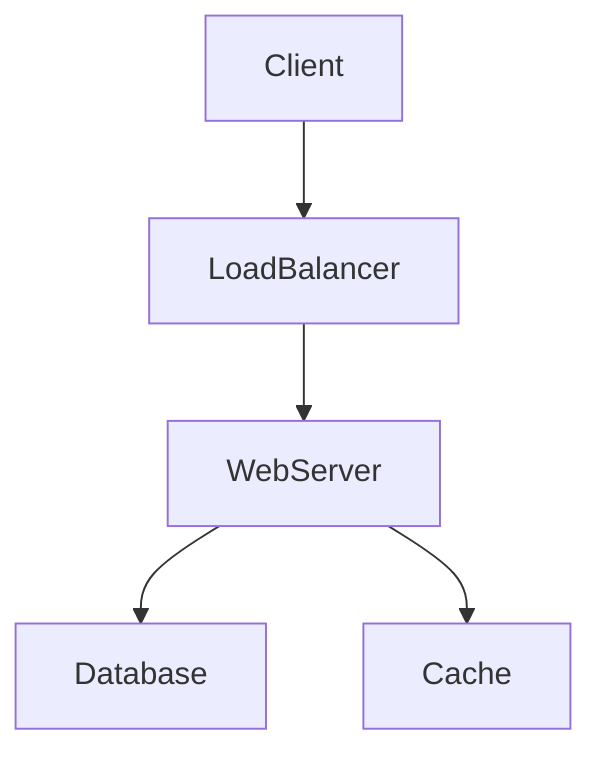

# 시스템 조사관 (System Investigator)

이 스킬은 새롭거나 생소한 코드베이스를 이해하고, 발견한 내용을 바탕으로 양질의 문서를 작성하는 것을 돕습니다.

## 이 스킬을 언제 사용하나요?

- 새로운 프로젝트를 처음부터 파악해야 할 때
- 시스템 아키텍처나 설계를 문서화해야 할 때
- 복잡한 이슈를 디버깅하며 여러 컴포넌트 간의 데이터 흐름을 추적해야 할 때
- 새로운 프로젝트에 온보딩하며 "지도"가 필요할 때

## 진행 단계

### 1. 프로젝트 개요 및 구조 파악

- **파일 목록 확인**: 루트 디렉토리를 조회하여(`list_dir` 또는 `find_by_name`) 프로젝트 레이아웃을 파악합니다.
- **프로젝트 유형 식별**: 주요 설정 파일을 찾아 프로젝트 유형을 결정합니다 (예: `pyproject.toml`, `package.json`, `go.mod`, `pom.xml`, `Dockerfile`, `docker-compose.yml`, `settings.py`).
- **상위 디렉토리 매핑**: 각 상위 디렉토리의 역할을 식별합니다 (예: 소스 코드, 테스트, 문서, 스크립트).

### 2. 기술 스택 분석

- **언어**: 주로 사용된 프로그래밍 언어를 파악합니다.
- **프레임워크 및 라이브러리**: 의존성 파일 (`requirements.txt`, `package.json`, `Gemfile`)을 확인하여 주요 프레임워크(Django, React, Spring 등)와 라이브러리를 식별합니다.
- **인프라**: `Dockerfile`, `docker-compose.yml`, Kubernetes 매니페스트, Terraform 파일 등을 찾아 인프라 및 배포 방식을 이해합니다.
- **데이터베이스**: 설정 파일이나 연결 문자열을 확인하여 사용 중인 데이터베이스(PostgreSQL, MySQL, MongoDB, Redis 등)를 식별합니다.

### 3. 아키텍처 매핑

- **진입점 (Entry Points)**: 애플리케이션의 주요 진입점을 찾습니다 (예: `manage.py`, `wsgi.py`, `main.go`, `index.js`).
- **핵심 컴포넌트**: 프로젝트 내의 주요 모듈이나 애플리케이션을 식별합니다. Django의 경우 설치된 앱(installed apps), 마이크로서비스의 경우 서비스 목록을 확인합니다.
- **데이터 모델**: 데이터베이스 모델/스키마를 검토하여 핵심 데이터 엔티티와 관계를 이해합니다.
- **데이터 흐름**: 시스템을 통과하는 주요 요청이나 데이터 파이프라인의 흐름을 추적합니다.

### 4. 문서 작성

`SYSTEM_ANALYSIS.md`라는 파일을 생성(또는 업데이트)하고 다음 구조를 따르세요:

```markdown
# [프로젝트 이름] 시스템 분석

## 1. 개요
[프로젝트가 무엇을 하는지, 목적에 대한 간략한 설명]

## 2. 기술 스택
- **언어**: [예: Python 3.9]
- **프레임워크**: [예: Django 3.2, FastAPI]
- **데이터베이스**: [예: PostgreSQL 13]
- **인프라**: [예: Docker, AWS]
- **주요 라이브러리**: [중요 라이브러리 목록]

## 3. 아키텍처
[상위 수준 아키텍처를 설명합니다. 가능하면 Mermaid 다이어그램을 사용하세요.]



## 4. 프로젝트 구조

- `/src`: 소스 코드
- `/tests`: 테스트
- ...

## 5. 핵심 컴포넌트 및 기능

- **인증 (Authentication)**: [설명]
- **핵심 로직**: [설명]
- **API**: [설명]

## 6. 개발 환경 설정

- **필수 조건**: [목록]
- **설치**: [단계]
- **실행**: [명령어]

## 7. 관찰 및 제언

- [코드 품질, 잠재적 이슈, 또는 개선 사항에 대한 구체적인 관찰 내용]

```

### 5. 검토 및 개선
- 문서가 정확하고 이해하기 쉬운지 확인합니다.
- 모든 핵심 컴포넌트가 다뤄졌는지 확인합니다.
- 누락된 세부 정보나 설명이 필요한 부분을 추가합니다.
